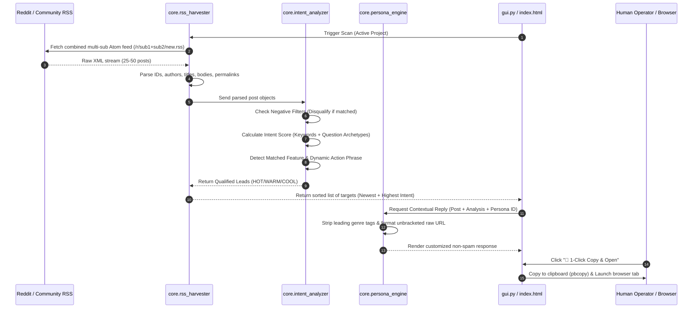

# 🎯 LeadSniper — Autonomous Community Radar & Lead Acquisition Engine
## 🤖 Technical Specification & Operational Guide for AI Agents

> **Author**: Antigravity Engineering Team  
> **Target Audience**: AI Coding Agents, Autonomous Subagents, System Architects  
> **Repository**: [ALittleExtraCode/lead-sniper](https://github.com/ALittleExtraCode/lead-sniper)  
> **Local Path**: `/Users/christophercohen/Desktop/leadsniper`

---

## 1. Executive Summary & Core Philosophy

**LeadSniper** is a universal, product-agnostic, zero-API social listening and lead acquisition engine. It continuously monitors live community discussions (Reddit, forums, feeds), extracts customer pain points, calculates buying/user intent scores, and synthesizes authentic, contextually tailored responses with **1-Click Assisted Conversion**.

### Core Tenets:
1. **Zero-API Ingestion**: Uses public Atom/RSS XML streams. Requires **zero API keys, zero OAuth secrets, and zero paid API subscriptions**. Completely immune to Reddit's 403 API paywalls.
2. **Strict Anti-Ban Quality Standard**: All outbound links in generated responses **MUST be 100% clean, unbracketed, raw URLs** (e.g. `https://sunoget.com/daw`). Markdown bracket traps (`[...]`, `(...)`, `**...**`) are strictly prohibited to maintain authentic human-to-human credibility and avoid spam heuristics.
3. **Human-in-the-Loop 1-Click Dispatch**: Instead of dangerous automated bot posting (which triggers automated rate limits, captcha traps, and IP bans), LeadSniper utilizes a semi-automated 1-click "Copy & Open" workflow. The operator clicks one button, the clean reply is placed on the system clipboard (`pbcopy`), and the exact thread is launched in the browser.
4. **Universal Multi-Product Agnosticism**: The engine is completely decoupled from any single product. Switching between SaaS products, creator tools, freelance services, or agencies is done instantly via JSON presets.

---

## 2. Directory & Component Architecture

```
leadsniper/
├── 🎯 app.py                 # Master CLI orchestrator & fallback launcher
├── 💻 gui.py                  # Dark-mode native Desktop Control Center (Tkinter)
├── ⚡ server.py               # Zero-dependency local web server & REST API (localhost:8080)
├── 🌐 index.html             # High-converting tactical HUD landing page & live web radar
├── 🧪 test_leadsniper.py      # Automated unit test suite (6/6 passing)
├── 📖 README.md               # Quickstart & user documentation
├── 🤖 AGENT_GUIDE.md          # This comprehensive agent architectural manual
├── ⚙️ wrangler.toml          # Cloudflare Worker edge deployment configuration
├── ⚡ _worker.js              # Cloudflare edge router serving static assets
├── 🔒 _headers               # Security & caching headers for Cloudflare
├── 🚫 .assetsignore           # Prevents server-side scripts from leaking publicly
├── ⚙️ presets/                # Modular Product Workspaces (JSON)
│   ├── sunoget.json          # SunoGet AI Music Studio & Batch Exporter
│   ├── generic_saas.json     # Micro-SaaS & Indie Product Growth
│   └── video_ai_tool.json    # Video Editing & Captioning Suite
└── 🧠 core/                   # Pure Engine Modules
    ├── project_manager.py    # Multi-project workspace switcher & preset loader
    ├── rss_harvester.py      # Zero-API real-time feed parser (anti-429 & anti-ban)
    ├── intent_analyzer.py    # Intent scoring (HOT 🔥 / WARM ⚡ / COOL ❄️) & negative filters
    └── persona_engine.py     # Contextual reply generator (enforces raw clean links)
```

---

## 3. Data Flow & Lead Lifecycle



---

## 4. Subsystems Deep-Dive

### 4.1. `core/rss_harvester.py` — Ingestion Engine
* **Combined Subreddit Requests**: Constructs multi-subreddit URLs (e.g. `https://www.reddit.com/r/SunoAI+aimusic+Songwriting/new.rss?limit=50`). This fetches 50 posts across multiple communities in a **single HTTP request**, providing a 6x speedup and preventing 429 rate limits.
* **Rotating User-Agents**: Uses randomized browser header signatures with cache-control headers to prevent stale CDN cache hits.
* **macOS SSL Fallback**: Automatically instantiates `ssl.create_default_context()` with a fallback to `ssl._create_unverified_context()` if system root certificates are unlinked.
* **Deduplication**: Tracks seen post IDs to ensure duplicate posts are filtered out before scoring.

### 4.2. `core/intent_analyzer.py` — NLP & Scoring Engine
* **Negative Filter**: Disqualifies posts containing blacklisted terms (e.g. `scam`, `refund`, `banned`, `chargeback`).
* **Scoring Formula**:
  * Base keyword match: `+15 points` per matched project keyword.
  * Question archetype match: `+35 points` (matches regex patterns like `\bhow (?:do|can|to)\b`, `\blooking for\b`, `\bwhat do you use\b`, `\brecommend\b`).
  * Title keyword density: `+25 points` if target keyword appears directly in the title.
* **Intent Tiers**:
  * `HOT 🔥` (Score ≥ 60%): High-intent prospects actively asking for tool recommendations or solutions.
  * `WARM ⚡` (Score 30–59%): Relevant topic discussions or creative showcases.
  * `COOL ❄️` (Score < 30%): Low-confidence keyword matches.
* **Action Phrase Extractor**: Automatically converts matched features into natural grammar phrases (e.g. `"batch-export and back up all master audio"`, `"render audio-reactive 9:16 video visualizers"`).

### 4.3. `core/persona_engine.py` — Response Synthesis Engine
* **Title Cleaning Pipeline**: Uses regex to clean leading tags (e.g. `[Electronic] "Vertigo" (Music Video)` ➔ `"Vertigo"`). Prevents empty string artifacts when titles begin with square brackets.
* **Strict Clean Link Guarantee**:
  * Programmatically strips markdown brackets: `[url]` ➔ `url`, `(url)` ➔ `url`, `**url**` ➔ `url`.
  * Ensures Reddit and Discord autolink the URL cleanly without triggering bot-flag heuristics.
* **Persona Profiles**:
  * `🚀 Helpful Founder`: Authentic, value-first builder perspective.
  * `⚙️ Technical Architect`: Concise, architectural, direct solution.
  * `🎬 Creator / Peer`: Casual creator-to-creator workflow recommendation.

### 4.4. `core/project_manager.py` — Preset Management
* Loads and persists JSON workspace configurations from `presets/`.
* Manages `active_project_id` and saves state to `config.json`.
* Lists and swaps active product configurations on the fly without restarting applications.

---

## 5. Preset JSON Schema Specification

Any new product, SaaS, or service can be configured by adding a `.json` file to `presets/`:

```json
{
  "id": "unique_project_id",
  "name": "Human Readable Project Name",
  "product_url": "https://yourdomain.com/tool",
  "description": "Short summary of product purpose.",
  "subreddits": [
    "TargetSubreddit1",
    "TargetSubreddit2"
  ],
  "keywords": [
    "keyword1", "keyword2", "workflow", "automate", "alternative"
  ],
  "negative_keywords": [
    "scam", "refund", "banned", "spam"
  ],
  "features": [
    {
      "name": "Feature Name",
      "trigger_words": ["trigger1", "trigger2", "keyword"]
    }
  ],
  "personas": [
    {
      "id": "persona_id",
      "name": "Emoji & Persona Title",
      "prompt_tone": "Description of voice and tone",
      "template": "Authentic message u/{author}! If you need to {action_phrase} for \"{title}\", check out {url}."
    }
  ]
}
```

### Template Interpolation Variables:
* `{author}`: Reddit poster's username.
* `{title}`: Cleaned post title.
* `{url}`: 100% raw unbracketed product URL.
* `{action_phrase}`: Dynamically generated natural action phrase from matched feature.
* `{feature}`: Name of the triggered feature.

---

## 6. Execution Modes & CLI Reference

### 6.1. Launching the Desktop GUI
```bash
cd /Users/christophercohen/Desktop/leadsniper
python3 gui.py
```
* Interactive Treeview radar with live sorting.
* 1-Click clipboard dispatch (`pbcopy`) and browser launcher.
* Real-time persona switcher buttons.

### 6.2. Running in Headless CLI Mode
```bash
# Scan the active project
python3 app.py --cli

# Scan a specific project preset directly
python3 app.py --cli --project sunoget
python3 app.py --cli --project saas_growth
```

### 6.3. Running Local Web Server
```bash
python3 server.py 8080
# Opens live web applet at http://localhost:8080
```

### 6.4. Running the Automated Test Suite
```bash
python3 -m unittest test_leadsniper.py
```

---

## 7. Cloudflare Edge Deployment Guidelines

LeadSniper is configured for deployment on **Cloudflare Workers & Assets**:
* `wrangler.toml`: Configured with `main = "_worker.js"` and `[assets] directory = "./"`.
* `.assetsignore`: **CRITICAL FILE**. Must ignore `_worker.js`, `wrangler.toml`, `.git/`, `README.md`, and `*.py` files so private server code is never served as downloadable static assets.
* GitHub Auto-Deploy: Pushes to `main` branch on `https://github.com/ALittleExtraCode/lead-sniper.git` automatically trigger Cloudflare builds.

---

## 8. Guidelines for Future AI Agents

When modifying or extending this codebase:
1. **Never Reintroduce Markdown Brackets in URLs**: The `#1` operational rule from the user is that links MUST be raw and clean (`https://...`). Never wrap URLs in `[...]` or `(...)` in reply templates or engines.
2. **Preserve Combined Feed Queries**: When adding new subreddits, always batch them using `+` concatenation to prevent 429 rate limit bans from Reddit.
3. **Keep Desktop & Web Presets Synchronized**: When adding a preset to `presets/`, ensure the preset key is also added to the interactive presets dictionary in `index.html` and `gui.py`.
4. **Maintain 100% Test Coverage**: Always run `python3 test_leadsniper.py` after modifying any core module to ensure zero regressions.
